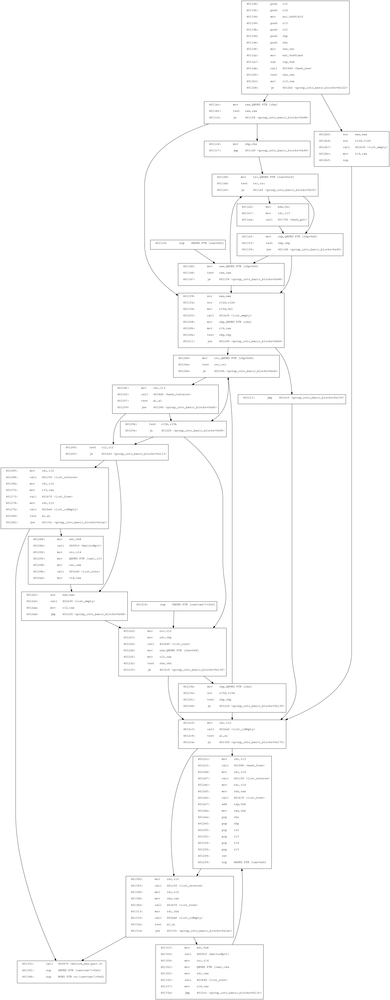

# asm2cfg

Converts assembly code into control flow graphs (rendered with DOT).


### Example

Takes input that looks like this:

```nasm
  401190:	push   r15
  401192:	push   r14
  401194:	mov    esi,0x401b10
  401199:	push   r13
  40119b:	push   r12
  40119d:	push   rbp
  40119e:	push   rbx
  40119f:	mov    rbx,rdi
  4011a2:	mov    edi,0x401ae0
  4011a7:	sub    rsp,0x8
  4011ab:	call   401640 <hash_new>
  4011b0:	test   rbx,rbx
  4011b3:	mov    r13,rax
  4011b6:	je     4012b2 <group_into_basic_blocks+0x122>
  4011bc:	mov    rax,QWORD PTR [rbx]
  4011bf:	test   rax,rax
  4011c2:	je     4011f8 <group_into_basic_blocks+0x68>
  4011c4:	mov    rbp,rbx
  4011c7:	jmp    4011d9 <group_into_basic_blocks+0x49>
  4011c9:	nop    DWORD PTR [rax+0x0]
  4011d0:	mov    rax,QWORD PTR [rbp+0x0]
  4011d4:	test   rax,rax
  4011d7:	je     4011f8 <group_into_basic_blocks+0x68>
  4011d9:	mov    rsi,QWORD PTR [rax+0x10]
  4011dd:	test   rsi,rsi
  4011e0:	je     4011ef <group_into_basic_blocks+0x5f>
  4011e2:	mov    edx,0x1
  4011e7:	mov    rdi,r13
  4011ea:	call   401700 <hash_put>
  4011ef:	mov    rbp,QWORD PTR [rbp+0x8]
  4011f3:	test   rbp,rbp
  4011f6:	jne    4011d0 <group_into_basic_blocks+0x40>
  4011f8:	xor    eax,eax
  4011fa:	xor    r12d,r12d
  4011fd:	mov    r15d,0x1
  401203:	call   401b30 <list_empty>
  401208:	mov    rbp,QWORD PTR [rbx]
  40120b:	mov    r14,rax
  40120e:	test   rbp,rbp
  401211:	jne    401246 <group_into_basic_blocks+0xb6>
  401213:	jmp    4012c0 <group_into_basic_blocks+0x130>
  401218:	nop    DWORD PTR [rax+rax*1+0x0]
  401220:	mov    rsi,r12
  401223:	mov    rdi,rbp
  401226:	call   401b40 <list_cons>
  40122b:	mov    rbx,QWORD PTR [rbx+0x8]
  [ ... few lines omitted ... ]
  40130e:	call   401b70 <list_free>
  401313:	mov    rdi,rbx
  401316:	call   401ba0 <list_isEmpty>
  40131b:	test   al,al
  40131d:	jne    40133c <group_into_basic_blocks+0x1ac>
  40131f:	mov    edi,0x8
  401324:	call   400910 <malloc@plt>
  401329:	mov    rsi,r14
  40132c:	mov    QWORD PTR [rax],rbx
  40132f:	mov    rdi,rax
  401332:	call   401b40 <list_cons>
  401337:	mov    r14,rax
  40133a:	jmp    4012cc <group_into_basic_blocks+0x13c>
  40133c:	call   400970 <bblock_new.part.0>
  401341:	nop    DWORD PTR [rax+rax*1+0x0]
  401346:	nop    WORD PTR cs:[rax+rax*1+0x0]
```

and turns it into a control flow graph that looks like this:




### What is it good for?

Mostly good for nostalgia about one of the greatest games I've ever played.

To quote a famous bomb from a famous lab:

>     Welcome to my fiendish little bomb. You have 6 phases with
>     which to blow yourself up. Have a nice day!
>     Phase 1 defused. How about the next one?
>     That's number 2.  Keep going!
>     Halfway there!
>     So you got that one.  Try this one.
>     Good work!  On to the next...
>     Curses, you've found the secret phase!
>     But finding it and solving it are quite different...
>     Wow! You've defused the secret stage!
>     Congratulations! You've defused the bomb!

Border relations with Canada have never been better.
